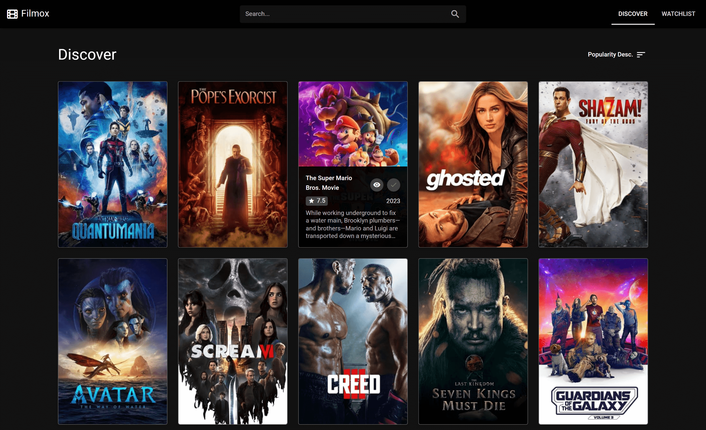
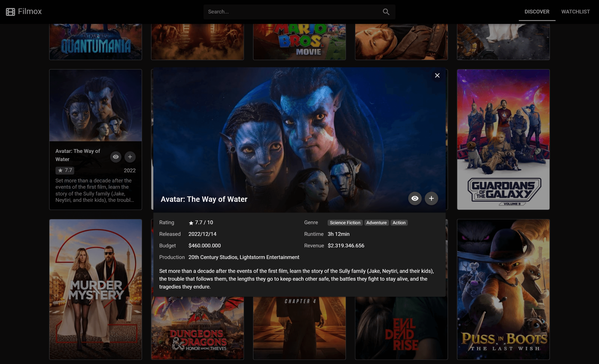
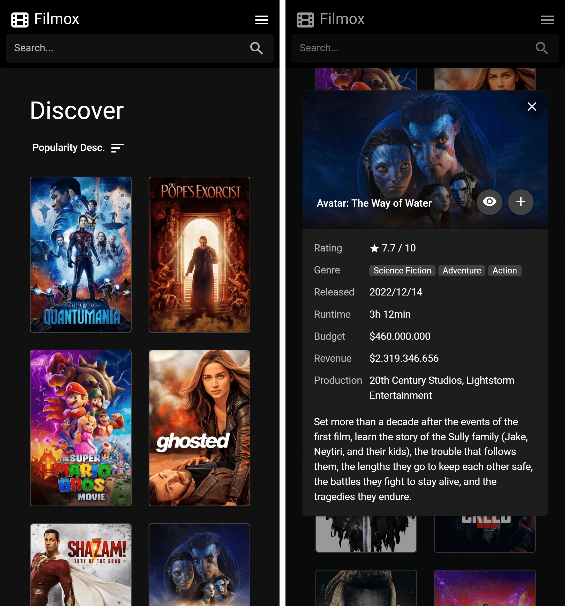

# Filmox (WIP)

Filmox is a movie watchlist application. It is built with [Quasar Framework](https://quasar.dev/), [Vue.Js](https://vuejs.org) and [Pinia](https://pinia.vuejs.org/). All the data is get from [](https://www.themoviedb.org/) API.

## Live Preview

Available at https://RodrigoJuliano.github.io/filmox/.

## Screenshots





## Project Setup

```sh
pnpm install
```

### Compile and Hot-Reload for Development

```sh
pnpm run dev
```

### Compile and Minify for Production

```sh
pnpm run build
```
